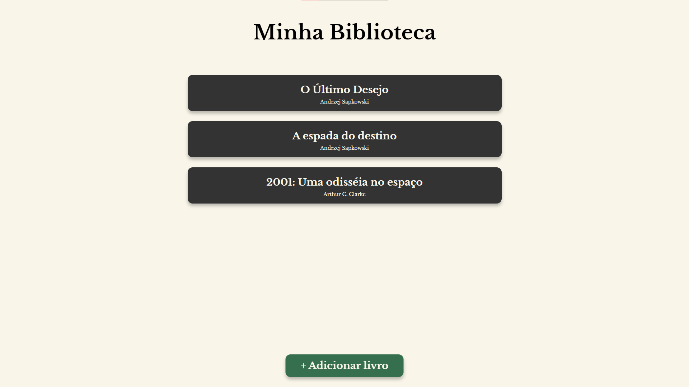

# Biblioteca

Este é um projeto de um app básico que gerencia uma lista de leitura. O projeto foi proposto pelo site [The Odin Project](https://www.theodinproject.com) para aprendizado de Classes e organização de código em JavaScript. O projeto pode ser acessado no link [diego-moreira8.github.io/odin-library](https://diego-moreira8.github.io/odin-library).

